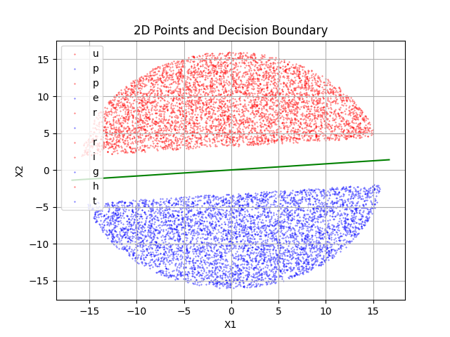

# CMSC5724_Project2_MarginPerceptron
CUHK CMSC 5724 Project #2: Margin Perceptron

# Usage
```bash
python margin_perceptron.py --dataset 2d-r16-n10000.txt

python margin_perceptron.py --dataset 4d-r24-n10000.txt

python margin_perceptron.py --dataset 8d-r12-n10000.txt
```

After running the code, logs will be stored at `./log` folder.

For 2D data, a sample picture of the dataset points and the classifier is below:


# Project Structure
```
├── README.md
├>> margin_perceptron.py
├── 2d_points_and_decision_boundary.png
├── datasets
│   ├── 2d-r16-n10000.txt
│   ├── 4d-r24-n10000.txt
│   └── 8d-r12-n10000.txt
├── log
│   ├── 2d-r16-n10000.log
│   ├── 4d-r24-n10000.log
│   └── 8d-r12-n10000.log
└── utils
    ├── argparser.py
    ├── dataset_loader.py
    ├── logger.py
    └── visualize_2d.py
```
# Key Components
## Imports and Setup:

Imports necessary libraries and utility functions for logging, argument parsing, dataset loading, and visualization.

## MarginPerceptron Class:

### Initialization:
* Initializes the weight vector w, bias b, learning rate eta, and maximum distance to origin R_max.
* Sets an initial guess for the margin gamma_guess.
### Methods:
* dot_product: Calculates the dot product of two vectors.
* vector_add: Adds two vectors, optionally scaling the second vector by a scalar.
* norm: Calculates the Euclidean norm of a vector.
* train: Trains the perceptron using the provided dataset. Adjusts weights and bias based on violation points and logs the updates.
* terminate_iter: Calculates the termination condition based on the margin guess.
* calculate_margin: Computes the minimum margin of the classifier.
* return_w and return_b: Return the current weight vector and bias, respectively.
## Main Execution:

* Parses command-line arguments to get the dataset path.
* Sets up logging with a filename based on the dataset.
* Loads and parses the dataset.
* Initializes and trains the Margin Perceptron model.
* Logs the final margin, weights, and bias.
# Dataset
Your implementation should work on any dataset in the following format:
The first line contains three numbers n, d, and r, where n is the number of points, d is the dimensionality of the instance space, and r is the radius.
The i-th line (where i goes from 2 to n + 1) gives the (i - 1)-th point in the dataset as: \
x1,x2,...,xd,label \
where the first d values are the coordinates of the point, and label = 1 or -1. \
We have prepared three datasets for you: \
2d-r16-n10000 \
4d-r24-n10000 \
8d-r12-n10000

# Deliverables
An executable program. \
A readme file detailing how to use the program. \
Source code. \
A report explaining the margin of your classifier for each of the three datasets.


